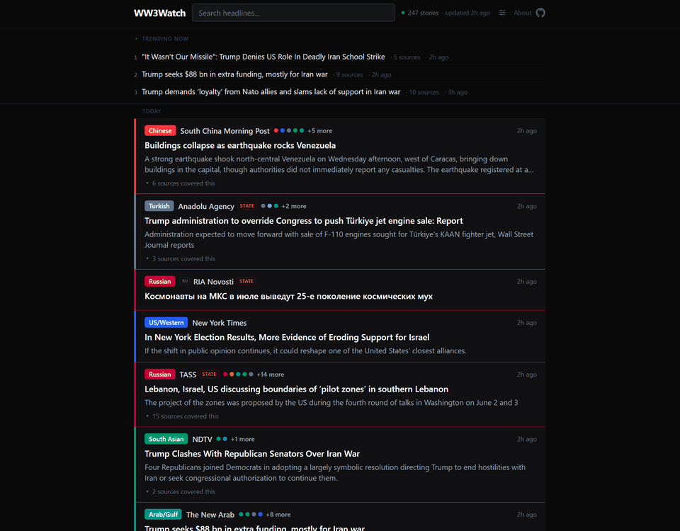

# WW3Watch

<p align="center">
  <a href="https://noahsabaj.github.io/ww3watch/">
    
  </a>
</p>

A real-time global news aggregator focused on geopolitical conflict and world events. 200 sources across every major region and perspective; related stories grouped across languages by multilingual embeddings; trending surfaced as it breaks. Headlines appear exactly as their newsrooms wrote them.

**Live at [noahsabaj.github.io/ww3watch](https://noahsabaj.github.io/ww3watch/)** · [How it works](https://noahsabaj.github.io/ww3watch/about)

> **The rule the system is built on:** machine intelligence routes stories — relevance, grouping, trending — but never rewrites them. The only model-touched content is opt-in translation, one click from the original. See [docs/CONVENTIONS.md](docs/CONVENTIONS.md).

## Features

- **Real-time feed** — new articles, story regroupings, and trending changes push live via Supabase Realtime
- **Cross-language story grouping** — multilingual embeddings (e5-base, run locally in the pipeline) group a Persian headline with the Norwegian and English coverage of the same event; deterministic, quota-free
- **Local relevance head** — a logistic-regression layer over those same embeddings, distilled monthly from the LLM's own verdicts, settles the confident mass of new articles on the runner; only the uncertain band spends LLM budget, and a random audit slice keeps checking the head against the LLM every run
- **Trending Now** — LLM-picked top stories, updating live
- **Wire detection** — near-identical copies inside a story are marked, so "12 sources" doesn't overstate independent confirmation
- **In-app reader + translation** — cached extraction (survives link rot), on-demand translation into your reading language (set once; defaults from your browser locale), the original one click away
- **Source roster with live health** — every feed and its fetch health, public on [/about](https://noahsabaj.github.io/ww3watch/about); a feed that fails for ~2 days straight is switched off and a feed-health issue is filed for re-curation
- **Freshness dead-man's switch** — the header shows when ingestion last succeeded; it goes amber/red if the pipeline stalls
- **Region + language filtering, RTL, PWA** — 15 region/perspective buckets and per-language toggles over whatever the feed contains; first-class Persian/Arabic/Hebrew rendering; installable

## Stack

All free-tier, no provider that pauses idle hobby projects:

- [SvelteKit](https://kit.svelte.dev/) + Svelte 5 runes — static SPA (`adapter-static`)
- [GitHub Pages](https://pages.github.com/) — hosting · [GitHub Actions](https://docs.github.com/actions) — scheduled ingestion (also runs as a container, see `Dockerfile`)
- [Supabase](https://supabase.com/) — Postgres (+pgvector, pg_cron retention) + Realtime + two Deno Edge Functions (`reader`, `translate`)
- [Transformers.js](https://huggingface.co/docs/transformers.js) — multilingual-e5-base embeddings, locally on the runner (story grouping)
- [Groq](https://groq.com/) — relevance classification, trending picks, and on-demand translation (any OpenAI-compatible endpoint works; translation can run on its own provider via `TRANSLATE_LLM_*` secrets)
- [Tailwind CSS v4](https://tailwindcss.com/)

## Architecture

```
GitHub Actions (self-chained, ~every 15 min) Browser (static SPA on GitHub Pages)
  scripts/run-pipeline.ts                      +page.ts ── anon read ──► Supabase
    roster ◄── sources table (health ──►)       realtime ◄── INSERT/UPDATE events
    fetch feeds (direct → CF proxy)             ArticlePanel ──► Edge Functions
    de-dup vs DB ∪ rejects                        reader (extract, cached)
    classify: local head → LLM (uncertain)        translate (LLM, cached)
    upsert articles (+body_hash wire marks)
    embed titles (local e5-base)
    assign stories (pgvector RPC) ──► stories
    recompute trending (LLM picks)
  pg_cron (daily): retention prune
```

- **Ingestion** is a Node script run by GitHub Actions ([.github/workflows/pipeline.yml](.github/workflows/pipeline.yml)) — or anywhere, via the `Dockerfile`. The feed roster lives in the `sources` table (health written back every run); curation is SQL, not commits.
- **Story grouping** is deterministic: titles embed through a pinned multilingual model on the runner, and a pgvector RPC assigns each article to the nearest story representative within a time window. No LLM in the loop.
- **Frontend** is a static SPA. The initial load ([src/routes/+page.ts](src/routes/+page.ts)) reads with the anon key; [Realtime](src/routes/+page.svelte) keeps articles, story regroupings, trending, and the freshness readout live.
- **`reader` / `translate`** run as Supabase Edge Functions ([supabase/functions](supabase/functions)) — they need a server (SSRF-guarded fetch, the LLM key). Content is cached raw and sanitized on the client with DOMPurify at `{@html}`, so sanitizer upgrades apply retroactively.

## Development

```bash
npm install
npm run dev          # frontend (needs PUBLIC_SUPABASE_* in .env)
npm test             # vitest
npm run check        # svelte-check

# run the ingestion pipeline once, locally:
node --import tsx --env-file=.env scripts/run-pipeline.ts
```

Copy `.env.example` → `.env` and fill in credentials.

## Deploy / setup

One-time setup (all free tier):

1. **Cerebras** — create an API key at [cloud.cerebras.ai](https://cloud.cerebras.ai/); note the model (`gpt-oss-120b`).
2. **Supabase**
   - Apply [supabase/migrations](supabase/migrations) in filename order — they build the whole schema from empty, including `articles` / `trending`, their anon-`SELECT` RLS policies, and realtime publication membership. Writes stay service-role only.
   - The edge functions and their LLM secrets deploy from GitHub ([deploy-functions.yml](.github/workflows/deploy-functions.yml)) once the secrets below exist — the functions' `LLM_*` secrets are synced from the repo's on every deploy, so they can't drift from the pipeline's. To deploy by hand instead:
     ```bash
     supabase functions deploy reader translate rss --no-verify-jwt
     supabase secrets set LLM_BASE_URL=https://api.groq.com/openai/v1 LLM_API_KEY=... LLM_MODEL=openai/gpt-oss-120b LLM_REASONING_EFFORT=low
     ```
3. **GitHub**
   - Repo **Settings → Secrets and variables → Actions** → add: `SUPABASE_URL`, `SUPABASE_SECRET_KEY` (the `sb_secret_…` key), `SUPABASE_ACCESS_TOKEN` (function deploys), `LLM_BASE_URL`, `LLM_API_KEY`, `LLM_MODEL`, `PUBLIC_SUPABASE_URL`, `PUBLIC_SUPABASE_ANON_KEY`, and (optional) `FEED_PROXY_URL` + `FEED_PROXY_SECRET`. Optional `TRANSLATE_LLM_BASE_URL` / `TRANSLATE_LLM_API_KEY` / `TRANSLATE_LLM_MODEL` point translation at a different provider than the pipeline (it sends a few large requests rather than many small ones, so a bigger per-request token cap matters more than RPM).
   - **Settings → Pages** → Source = **GitHub Actions**.
   - Push to `main`: [deploy.yml](.github/workflows/deploy.yml) publishes the site; [pipeline.yml](.github/workflows/pipeline.yml) ingests about every 15 min — each run dispatches the next, and the cron is only the backstop that restarts the chain, since GitHub throttles a bare `*/15` schedule to a handful of runs a day (or run it manually via **Actions → Ingestion pipeline → Run workflow**; cancelling a run stops the chain until the cron restarts it).
4. **Feed proxy (optional but recommended)** — many news-site WAFs block GitHub Actions' datacenter IPs, killing most feeds. The pipeline therefore fetches **proxy-first** (with a direct fallback) through the Cloudflare Worker in [cloudflare/feed-proxy.js](cloudflare/feed-proxy.js) when configured. Setup:
   - Add `FEED_PROXY_URL` + `FEED_PROXY_SECRET` to the GitHub Actions secrets above, and set the Worker secret to the same value: `wrangler secret put FEED_PROXY_SECRET`.
   - For automatic Worker deploys, add `CLOUDFLARE_API_TOKEN` + `CLOUDFLARE_ACCOUNT_ID` repo secrets — then [deploy-worker.yml](.github/workflows/deploy-worker.yml) deploys [cloudflare/](cloudflare/) (config in [cloudflare/wrangler.toml](cloudflare/wrangler.toml)) on every push to `main` that touches it, and dry-run-validates PRs. Without the token the deploy step warns and skips, so you can also deploy by hand: `npx wrangler deploy` from `cloudflare/`. Free tier covers it. DB schema lives in [supabase/migrations](supabase/migrations).

> The site deploys to `https://<user>.github.io/ww3watch` (the `BASE_PATH=/ww3watch` in the deploy workflow handles the sub-path). For a custom domain, set `BASE_PATH` to empty and add a `CNAME`.

> Scheduled GitHub Actions are auto-disabled after 60 days of **repo** inactivity — ordinary commits keep them alive.

## License

[AGPL-3.0](LICENSE) — the copyleft that applies to network services: if you run a
modified WW3Watch as a website, you must offer your users the modified source.
Chosen deliberately. This project's credibility rests on its pipeline being
auditable — the LLM routes stories (classification, clustering, trending) but
never rewrites what journalists wrote — and AGPL keeps every public derivative
auditable on the same terms. The license covers this code, not the aggregated
news content, which belongs to its publishers.
